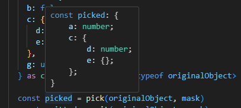

# ngx-signal-i18n


This package provides a typesafe and lazy-loaded internationalization (i18n) solution for Angular applications, built on top of signals for improved reactivity. It is compatible with zoneless Angular.


This project is inspired by [typesafe-i18n](https://github.com/ivanhofer/typesafe-i18n)

## Features
⛑️ Typesafety: Enforces type safety for translations depending on a default language.\
🦥 Lazy Loading: Translations are loaded on demand, improving initial bundle size.\
🚦 Signal Based: Leverages signals for efficient reactivity and change detection.\
🏃‍♂️ Zoneless Angular Compatibility: Works seamlessly with zoneless Angular applications.\
📄 Parameterized Translations: Supports translations with parameters for dynamic content.\
🛠️ Template Interpolation Pipe: Provides a pipe for easy interpolation of translations in your templates.\
🎭 Masking Utility: Provides utility types for omitting and picking specific translations which comes in handy when dealing with parameterized translations.\
🦺 Testing Proxy: Includes a proxy utility to simplify mocking translations during testing.\
🐤 Lightweight Build: ~ 1kb\
📦 Minimal Dependencies\
⛔ No Magic: Just Typescript


## Table of Content
- [Installation](#installation)
- [Usage](#usage)
- [Deep Pick and Omit Utility](#deep-pick-and-omit-utility)
- [Configuration](#configuration)
- [Writing Tests](#writing-tests)
- [Examples](#sample-projects)

## Installation
```Bash
npm i ngx-signal-i18n
```

## Usage
```html
<!-- app.component.html -->
<main>
  <select (change)="onLanguageChange($event)">
    <option value="en">en</option>
    <option value="de">de</option>
  </select>
  <hr /> <br />

  <h2>simple access for non interpolated values</h2>
  <h3>{{ translationService.translation().title}}</h3>
  <h3>{{ translationService.translation().simpleNest.str}}</h3>
  <h3>{{ translationService.translation().nest.title}}</h3>
  <hr /> <br />

  <h2>interpolated values from the ts file</h2>
  <h3>{{ interpolatedTranslations().title }}</h3>
  <h3>{{ interpolatedTranslations().simpleNest.str }}</h3>
  <h3>{{ interpolatedTranslations().nest.title }}</h3>
  <h3>{{ interpolatedTranslations().nest.anotherInterpolatedValue()}}</h3>
  <h3>{{ interpolatedTranslations().interpolatable()}}</h3>
  <hr /> <br />

  <h2>inline interpolation with the interpolation pipe</h2>
  <!-- inline interpolation for strings is unessesary but possible -->
  <h3>{{ translationService.translation().title | interpolate: undefined }}</h3>
  <h3>{{ translationService.translation().simpleNest.str | interpolate: undefined}}</h3>
  <h3>{{ translationService.translation().nest.title | interpolate: undefined}}</h3>

  <!-- inline intepolation of nested object is possible as well but rather questionable -->
  <h3>{{ (translationService.translation().nest
    | interpolate: { anotherInterpolatedValue: { num: numSignal } }).anotherInterpolatedValue() }}</h3>
  <h3>{{ (translationService.translation().nest | interpolate: { anotherInterpolatedValue: { num: numSignal } }).title
    }}</h3>

  <!-- inline interpolation for parameterized translations  -->
  <!-- mind the brackets because | interpolate returns a computed  -->
  <h3>{{ (translationService.translation().nest.anotherInterpolatedValue | interpolate: {num: numSignal})() }}</h3>
  <h3>{{ (translationService.translation().interpolatable | interpolate: {text: textSignal})() }}</h3>
</main>
```

```ts
//  app.component.ts
import { Component, computed, inject, signal } from '@angular/core';
import { interpolate, InterpolatePipe } from 'ngx-signal-i18n';
import { SupportedLanguage } from '../i18n/i18n-config';
import { TranslationService } from '../i18n/translation.service';

@Component({
  selector: 'app-root',
  standalone: true,
  imports: [InterpolatePipe],
  templateUrl: './app.component.html',
})
export class AppComponent {
  protected translationService = inject(TranslationService);

  protected textSignal = signal('text');
  protected numSignal = signal(0);

  protected interpolatedTranslations = computed(() => {
    return interpolate(this.translationService.translation(), {
      interpolatable: { text: this.textSignal },
      nest: { anotherInterpolatedValue: { num: this.numSignal } }
    })
  })

  protected onLanguageChange($event: Event): void {
    const lang = ($event.target as any).value as SupportedLanguage;
    this.translationService.setLanguage(lang);
  }
}
```


## Deep Pick and Omit Utility
Sometimes translation structures require more parameters than you have available. Providing unnecessary parameters can be cumbersome. To simplify this process, this library offers `pick` and `omit` functions that extract specific values from complex objects using a boolean mask.

```ts
import { Mask, omit, pick } from 'ngx-signal-i18n';

const originalObject = {
  a: 12,
  b: "13",
  c: {
    d: 14,
    e: {
      f: 15
    },
    f: 16
  },
  g: () => 17
}

const mask = {
  a: true,
  b: false,
  c: {
    d: true,
    e: {},
  },
  g: undefined
} as const satisfies Mask<typeof originalObject>

const picked = pick(originalObject, mask)
const omitted = omit(originalObject, mask)
console.log(picked) // {a: 12, c: {d: 14, e: {}}}
console.log(omitted) // {b: "13", c: {e: {f: 15}, h: 16}}

```



## Configuration
### 1. Define Main Translation Files
Define the main translation which defines the structure every other Translation must follow

```ts
// src/i18n/en/index.ts
import { computed, Signal } from '@angular/core';
import { TranslationShapeBase } from 'ngx-signal-i18n';

const en = {
  title: 'title',
  interpolatable: (params: { text: Signal<string> }) =>
    computed(() => `this is a interpolated value: ${params.text()}`),
  nest: {
    title: 'nested title',
    anotherInterpolatedValue: (params: { num: Signal<number> }) =>
      computed(() => `this is a nested value ${params.num()}`),
  },
  simpleNest: {
    str: 'F',
  }
} satisfies TranslationShapeBase;

export default en;
```
### 2. Define Translation config

>In order to prevent a lot of syntax boilerplate to deal with undefined, having a default language and default translation is highly recommended!

```ts
// src/i18n/i18n.config.ts
import { InjectionToken } from '@angular/core';
import { DefaultLanguageOf, TranslationConfigBase } from 'ngx-signal-i18n';
import en from './en';

export type SupportedLanguage = 'de' | 'en'
export type TranslationShape = typeof en;

export const translationConfig = {
  defaultTranslation: en,
  defaultLanguage: "en",
  useCache: true
} as const satisfies TranslationConfigBase<SupportedLanguage, TranslationShape>;

export type TranslationConfig = typeof translationConfig;
export type DefaultLanguage = DefaultLanguageOf<TranslationConfig>;

export const TranslationConfigToken = new InjectionToken<TranslationConfig>("translationConfig", { factory: () => translationConfig })
```
### 3. Add another Translation to the project
Add another translation that has the type of the main translation

```ts
// src/i18n/de/index.ts
import { computed, Signal } from '@angular/core';
import { TranslationShape } from '../i18n-config';

const de: TranslationShape = {
  title: 'Titel',
  interpolatable: (params: { text: Signal<string> }) =>
    computed(() => `Das ist ein intepolierter Wert: ${params.text()}`),
  nest: {
    title: 'geschachtelter Titel',
    anotherInterpolatedValue: (params: { num: Signal<number> }) =>
      computed(() => `Das ist ein geschachtelter interpolierter Wert ${params.num()}`),
  },
  simpleNest: {
    str: 'F',
  }
};

export default de;
```
### 4. Create Translation Service

```ts
// src/i18n/translation.service.ts
import { Inject, Injectable } from '@angular/core';
import { NgxSignalI18nBaseService } from 'ngx-signal-i18n';
import { SupportedLanguage, TranslationConfig, TranslationConfigToken, TranslationShape } from './i18n-config';

export let globalLanguage: SupportedLanguage;

@Injectable({
  providedIn: 'root',
})
export class TranslationService extends NgxSignalI18nBaseService<SupportedLanguage, TranslationShape, TranslationConfig> {

  constructor(@Inject(TranslationConfigToken) config: TranslationConfig) {
    super(config);
  }

  protected override async resolutionStrategy(lang: SupportedLanguage): Promise<TranslationShape> {
    // lazy load translation file
    return (await import(`./${lang}/index.ts`)).default
  }
}
```
### 5. Include Translation files in tsconfig
Add the following line to `tsconfig.app.json` and `tsconfig.spec.json` 
```json
{
  "compilerOptions": {
    "include": [
      "src/i18n/**/index.ts", // <-- add this line
    ]
}
```

## Writing Tests
When writing tests, the specific language often doesn't matter. This package provides a utility function that creates a proxy of a Translation object. Instead of returning actual translation values, the proxy returns the path to the desired translation

Declare `TranslationTestingService`
```ts
// src/i18n/translation-testing.service.ts
import { Inject, Injectable } from '@angular/core';
import { createProxy } from 'ngx-signal-i18n';
import { SupportedLanguage, TranslationConfig, TranslationConfigToken, TranslationShape } from './i18n-config';
import { TranslationService } from './translation.service';

@Injectable()
export class TranslationTestingService extends TranslationService {

  constructor(@Inject(TranslationConfigToken) config: TranslationConfig) {
    // override the default translation with a proxy that return the access path instead of the value
    const testingConfig = { ...config, defaultTranslation: createProxy(config.defaultTranslation) };
    super(testingConfig)
  }

  protected override async resolutionStrategy(_: SupportedLanguage): Promise<TranslationShape> {
    // don't actually resolve translation because the proxy will return the same value anyway
    return this.config.defaultTranslation
  }
}
```

Replace `TranslationService` with `TranslationTestingService` with the Angular DI in tests

```ts 
// app.component.spec.ts
import { TestBed } from '@angular/core/testing';
import { AppComponent } from './app.component';
import { TranslationService } from './translation/translation.service';
import { TranslationTestingService } from './translation/translation-testing/translation-testing.service';

describe('AppComponent', () => {
  beforeEach(async () => {
    await TestBed.configureTestingModule({
      providers: [
        // replace TranslationService with TranslationTestingService for tests
        { provide: TranslationService, useClass: TranslationTestingService },
      ],
      imports: [AppComponent],
    }).compileComponents();
  });

  it('should create the app', () => {
    const fixture = TestBed.createComponent(AppComponent);
    const app = fixture.componentInstance;
    expect(app).toBeTruthy();
  });
```


## Examples
See sample projects on [GitHub](https://github.com/yagcioe/ngx-signal-i18n)
- [Simple Example](https://github.com/yagcioe/ngx-signal-i18n/tree/main/samples/simple)
- [Lazy Loaded Module and Translations](https://github.com/yagcioe/ngx-signal-i18n/tree/main/samples/lazyModules)
- [StackBlitz](https://stackblitz.com/edit/stackblitz-starters-w7jtm3?file=src%2Fmain.ts)